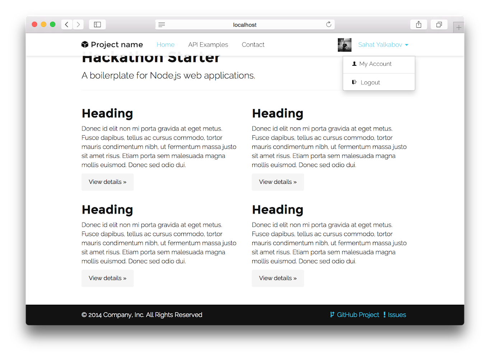

# Hackathon Starter Ansible Playbook

This playbook demonstrae how to use the Ansible to deploy the Hackathon Starter, A boilerplate for Node.js web applications to IKS cluster using ansible k8 roles. 
Github URL: https://github.com/sahat/hackathon-starter/blob/master/README.md

## Steps to run with IBM Cloud Schematics. 

### Prerequisite

1.  IBM Cloud Kubernetes cluster

    The following cluster template was used to create the example. https://github.com/terraform-ibm-modules/terraform-ibm-cluster/tree/master/modules/classic-kubernetes-single-zone

### Run the ansible playbook using Schematics CLI.

1. Create `action.json` with `Action` defination. Edit the payload as per your defination and run IBM Cloud CLI `ibmcloud schematics action create -f action.json`

```
{
  "name": "Hackathon_Starter_Action",
  "description": "This Action will deploy boiler plate code for Hackathon Starter",
  "location": "us-east",
  "resource_group": "Default",
   "source": {
       "source_type" : "git",
       "git" : {
            "git_repo_url": "https://github.com/Cloud-Schematics/ansible-app-deploy-iks.git"
       }
  },
  "command_parameter": "site.yml",
  "tags": [
    "string"
  ],
  "inputs": [
    {
      "name": "cluster_id",
      "value": <You-Cluster-ID>,
      "metadata": {
        "type": "string",
        "default_value": <Your-Default-Cluster-ID>
      }
    }
  ],
  "source_type": "GitHub" 
}
```

2. Create Job to run the above action. Create `job.json` with `job` defination. Edit the `Action ID` from step 1 and run `ibmcloud schematics job create -f payload.json`

```
{
  "command_object": "action",
  "command_object_id": <Action-ID>,
  "command_name": "ansible_playbook_run"
}
```

3. Once the job complete browse the application on the public IP.




  
## Run the ansible playbook using Schematics UI

In this example, we will use the Schematics Actions UI to create a new `Start VSI` Action, using the `start-vsi-playbook.yml` playbook.  
Further, use the Schematics Job API to run the newly created `Start VSI` action.

Steps:

- Open https://cloud.ibm.com/schematics/actions to view the list of Schematics Actions.
- Click `Create action` button to create a new Schematics Action definition
- In the Create action page - section 1, provide the following inputs, to create a `Hackathon-Starter` action in `Draft` state.
  * Action name : Hackathon Starter
  * Resource group: default
  * Location : us-east
- In the Create action page - section 2, provide the following input
  * Github url : https://github.com/Cloud-Schematics/ansible-app-deploy-iks.git
  * Click on `Retrieve playbooks` button
  * Select `site.yml` from the dropdown
- In the Create action page - Advanced options, provide the following input
  * Add `cluster_id` as key and `<cluster id of Cluster>` as value
- Press the `Next` button, and wait for the newly created `Hackathon-Starter` action to move to `Normal` state.
- Once the `Hackathon-Starter` action is in `Normal` state, you can run press the `Run action` button to initiate the Schematics Job
  * You can view the job status and the job logs (or Ansible logs) in the Jobs page of the `Hackathon-Starter` Schematics Action
  * Jobs page of the `Hackathon-Starter` Schematics Action will list all the historical jobs that was executed using this Action definition


## FAQ

### How to debug and get verbose logs while running actions?


For debugging purpose create action with verbose settings.

```
"inputs": [...],
"settings":[
      {
      "name": "verbose",
      "value": "4",
       "metadata": {
        "type": "string",
        "default_value": "0",
        "secure": false,
        "immutable": false,
        "hidden": false
      }
      }
  ],
  "tags": [
    "string"
  ]
  ```

###  How to check the home page IP Address for the application?

1. Run the below command to find the IP address.
`kubectl describe svc webapp`
2. Find the field `LoadBalancer Ingress`. 

### Why my load balancer does not have a public IP? 
This can be because of subnet or network policies which were used while cluster creation. 
